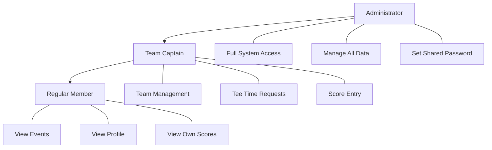
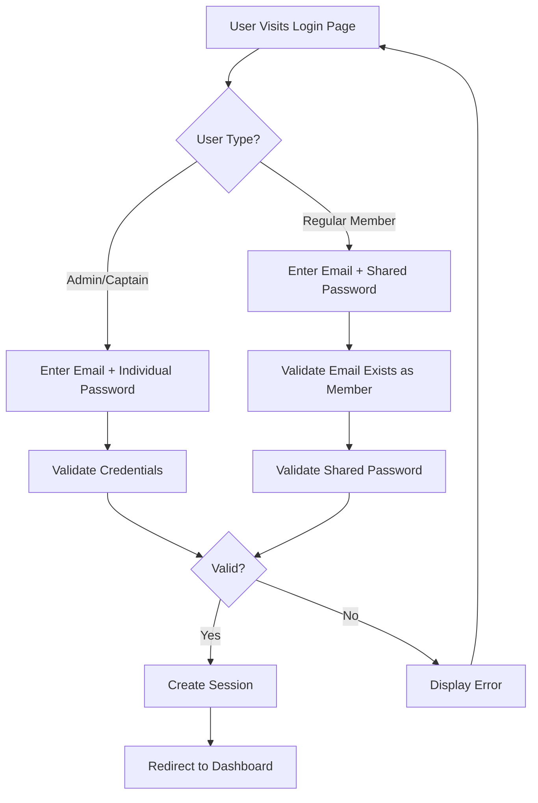
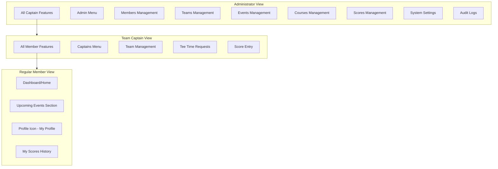
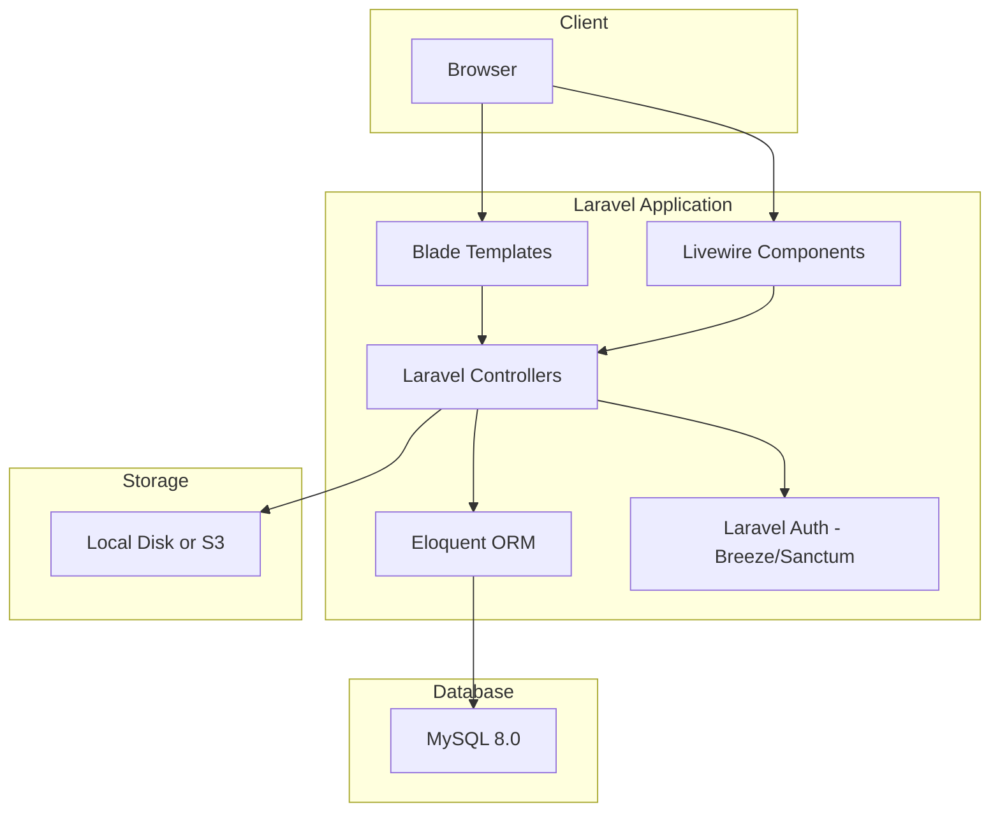
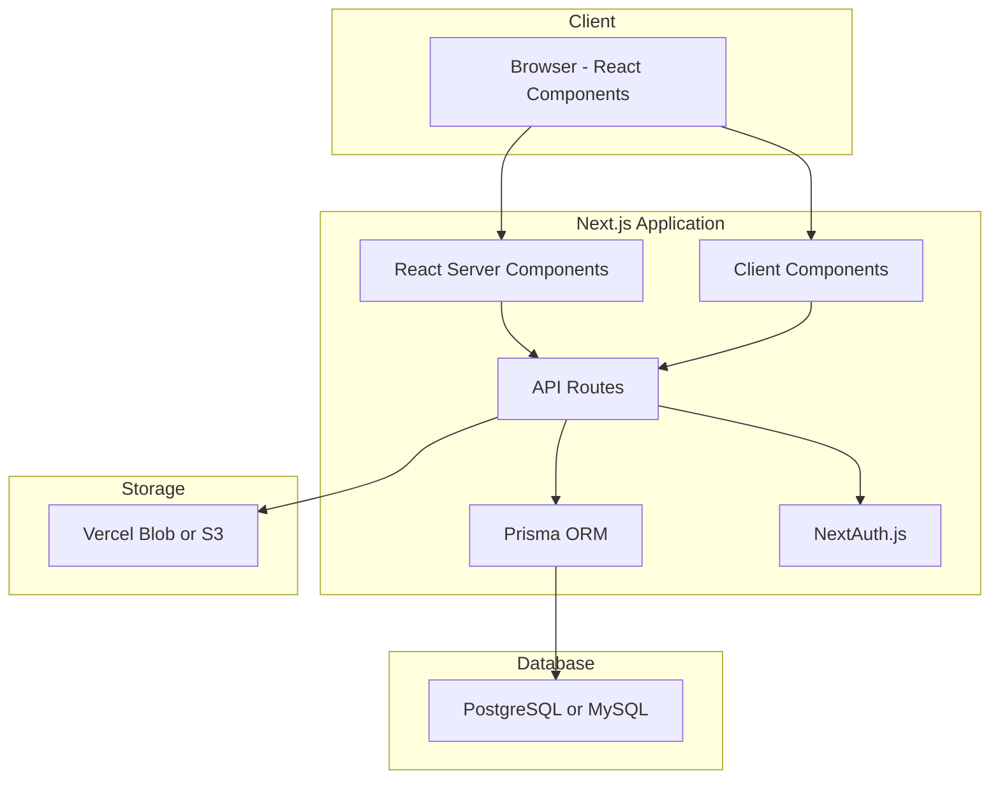

# MCSGA Golf Association Portal
## Application Specification and Requirements Document

**Version:** 1.1
**Date:** January 18, 2026
**Status:** Draft

---

## Table of Contents

1. [Executive Summary](#1-executive-summary)
2. [User Roles and Authentication](#2-user-roles-and-authentication)
3. [Database Schema](#3-database-schema)
4. [User Interface and Navigation](#4-user-interface-and-navigation)
5. [Forms and CRUD Operations](#5-forms-and-crud-operations)
6. [Special Reports](#6-special-reports)
7. [Audit Logging](#7-audit-logging)
8. [Non-Functional Requirements](#8-non-functional-requirements)
9. [Technology Stack Options](#9-technology-stack-options)
10. [Future Enhancements](#10-future-enhancements)

---

## 1. Executive Summary

### 1.1 Purpose

The MCSGA Golf Association Portal is a web-based application designed to serve as a central hub for members of the MCSGA golf association. The portal provides information about upcoming golf events, manages member and team data, and facilitates score tracking for golf outings.

### 1.2 Key Features

- **Event Management**: Display and manage upcoming golf outing events with course details
- **Member Management**: Maintain member profiles and team assignments
- **Team Organization**: Group members into teams with designated team captains
- **Score Tracking**: Record and report golf scores for events
- **Tee Time Coordination**: Allow captains to request tee times and administrators to assign them
- **Role-Based Access**: Three-tier permission system (Administrator, Team Captain, Member)

### 1.3 Target Users

- Golf association administrators
- Team captains
- Regular members of the MCSGA

---

## 2. User Roles and Authentication

### 2.1 User Role Hierarchy



### 2.2 Role Definitions

#### 2.2.1 Administrator
- **Access Level**: Full system access
- **Authentication**: Individual email and password
- **Capabilities**:
  - View and edit all pages/sections of the website
  - Manage all database tables (Members, Teams, Events, Courses, Scores)
  - Set and update the shared member password
  - Assign team captain privileges to members
  - Assign tee times to teams for events
  - View all audit logs
  - Upload course photos and information

#### 2.2.2 Team Captain
- **Access Level**: Elevated member privileges
- **Authentication**: Individual email and password
- **Capabilities**:
  - All regular member capabilities
  - Register their team for events
  - Manage team roster (add/remove members)
  - Request tee times for upcoming events
  - Enter golf scores for team members at events
  - View team-specific reports

> **Note**: A team may have more than one captain. A member can be a captain of one team while being a regular member of another.

#### 2.2.3 Regular Member
- **Access Level**: Basic read access with limited profile editing
- **Authentication**: Email address + shared password
- **Capabilities**:
  - View upcoming events and course information
  - View their team's assigned tee times
  - View and edit their own profile information
  - View their personal score history

### 2.3 Authentication System

#### 2.3.1 Current Implementation (Phase 1)



**Key Authentication Features:**
- Administrators and Team Captains have individual passwords stored with their profiles
- Regular members share a common password set by administrators
- All users log in using their email address
- No individual password management required for regular members
- Administrator UI includes option to set/change the shared member password

#### 2.3.2 Future Enhancement (Phase 2)
- Google OAuth integration for single sign-on
- Optional individual passwords for members who prefer them

### 2.4 Session Management
- Sessions should be maintained securely with appropriate timeout periods
- All login and logout events must be logged (see Section 7)

---

## 3. Database Schema

### 3.1 Entity Relationship Diagram

```mermaid
erDiagram
    MEMBERS ||--o{ TEAM_MEMBERS : belongs_to
    TEAMS ||--o{ TEAM_MEMBERS : contains
    MEMBERS ||--o{ TEAM_CAPTAINS : can_be
    TEAMS ||--o{ TEAM_CAPTAINS : has
    EVENTS ||--|| COURSES : held_at
    MEMBERS ||--o{ SCORES : has
    EVENTS ||--o{ SCORES : records
    TEAMS ||--o{ TEE_TIME_REQUESTS : requests
    EVENTS ||--o{ TEE_TIME_REQUESTS : for
    TEAMS ||--o{ EVENT_REGISTRATIONS : registers
    EVENTS ||--o{ EVENT_REGISTRATIONS : has
    MEMBERS ||--o{ AUDIT_LOG : generates
    
    MEMBERS {
        int id PK
        string email UK
        string first_name
        string last_name
        string phone
        string password_hash NULL
        boolean is_admin
        int primary_team_id FK
        datetime created_at
        datetime updated_at
    }
    
    TEAMS {
        int id PK
        string team_name
        string description
        datetime created_at
        datetime updated_at
    }
    
    TEAM_MEMBERS {
        int id PK
        int team_id FK
        int member_id FK
        boolean is_primary_team
        datetime joined_at
    }
    
    TEAM_CAPTAINS {
        int id PK
        int team_id FK
        int member_id FK
        datetime assigned_at
    }
    
    COURSES {
        int id PK
        string course_name
        string description
        string address
        string city
        string state
        string zip_code
        string google_maps_url
        text course_details
        datetime created_at
        datetime updated_at
    }
    
    COURSE_PHOTOS {
        int id PK
        int course_id FK
        string photo_url
        string caption
        int display_order
        datetime uploaded_at
    }
    
    EVENTS {
        int id PK
        string event_name
        date event_date
        int course_id FK
        text description
        string status
        datetime created_at
        datetime updated_at
    }
    
    EVENT_REGISTRATIONS {
        int id PK
        int event_id FK
        int team_id FK
        datetime registered_at
    }
    
    TEE_TIME_REQUESTS {
        int id PK
        int event_id FK
        int team_id FK
        int requested_by FK
        time preferred_time
        string status
        time assigned_time
        int assigned_by FK
        datetime requested_at
        datetime assigned_at
    }
    
    SCORES {
        int id PK
        int event_id FK
        int member_id FK
        int team_id FK
        int total_score
        int entered_by FK
        datetime created_at
        datetime updated_at
    }
    
    AUDIT_LOG {
        int id PK
        int user_id FK
        string action_type
        string table_name
        int record_id
        text details
        datetime created_at
    }
    
    SYSTEM_SETTINGS {
        int id PK
        string setting_key UK
        string setting_value
        datetime updated_at
        int updated_by FK
    }
```

### 3.2 Core Tables

#### 3.2.1 MEMBERS
Stores all individual members of the MCSGA.

| Column | Type | Constraints | Description |
|--------|------|-------------|-------------|
| id | INT | PK, AUTO_INCREMENT | Unique identifier |
| email | VARCHAR(255) | UNIQUE, NOT NULL | Login email address |
| first_name | VARCHAR(100) | NOT NULL | Member's first name |
| last_name | VARCHAR(100) | NOT NULL | Member's last name |
| phone | VARCHAR(20) | NULL | Contact phone number |
| password_hash | VARCHAR(255) | NULL | Individual password (Admins/Captains only) |
| is_admin | BOOLEAN | DEFAULT FALSE | Administrator flag |
| primary_team_id | INT | FK, NULL | Reference to primary team |
| created_at | DATETIME | NOT NULL | Record creation timestamp |
| updated_at | DATETIME | NOT NULL | Last update timestamp |

#### 3.2.2 TEAMS
Stores team information.

| Column | Type | Constraints | Description |
|--------|------|-------------|-------------|
| id | INT | PK, AUTO_INCREMENT | Unique identifier |
| team_name | VARCHAR(100) | NOT NULL | Name of the team |
| description | TEXT | NULL | Team description |
| created_at | DATETIME | NOT NULL | Record creation timestamp |
| updated_at | DATETIME | NOT NULL | Last update timestamp |

#### 3.2.3 TEAM_MEMBERS (Linking Table)
Associates members with teams (many-to-many relationship).

| Column | Type | Constraints | Description |
|--------|------|-------------|-------------|
| id | INT | PK, AUTO_INCREMENT | Unique identifier |
| team_id | INT | FK, NOT NULL | Reference to team |
| member_id | INT | FK, NOT NULL | Reference to member |
| is_primary_team | BOOLEAN | DEFAULT FALSE | Indicates if this is member's primary team |
| joined_at | DATETIME | NOT NULL | When member joined team |

> **Unique Constraint**: (team_id, member_id) - A member can only be in a team once

#### 3.2.4 TEAM_CAPTAINS (Linking Table)
Designates which members are captains of which teams.

| Column | Type | Constraints | Description |
|--------|------|-------------|-------------|
| id | INT | PK, AUTO_INCREMENT | Unique identifier |
| team_id | INT | FK, NOT NULL | Reference to team |
| member_id | INT | FK, NOT NULL | Reference to member |
| assigned_at | DATETIME | NOT NULL | When captain role was assigned |

> **Note**: A team can have multiple captains. A member can be captain of multiple teams.

#### 3.2.5 COURSES
Stores golf course information.

| Column | Type | Constraints | Description |
|--------|------|-------------|-------------|
| id | INT | PK, AUTO_INCREMENT | Unique identifier |
| course_name | VARCHAR(200) | NOT NULL | Name of the golf course |
| description | TEXT | NULL | Course description |
| address | VARCHAR(255) | NULL | Street address |
| city | VARCHAR(100) | NULL | City |
| state | VARCHAR(50) | NULL | State |
| zip_code | VARCHAR(20) | NULL | ZIP/Postal code |
| google_maps_url | VARCHAR(500) | NULL | Link to Google Maps |
| course_details | TEXT | NULL | Additional course details |
| created_at | DATETIME | NOT NULL | Record creation timestamp |
| updated_at | DATETIME | NOT NULL | Last update timestamp |

#### 3.2.6 COURSE_PHOTOS
Stores photos associated with courses.

| Column | Type | Constraints | Description |
|--------|------|-------------|-------------|
| id | INT | PK, AUTO_INCREMENT | Unique identifier |
| course_id | INT | FK, NOT NULL | Reference to course |
| photo_url | VARCHAR(500) | NOT NULL | URL/path to photo |
| caption | VARCHAR(255) | NULL | Photo caption |
| display_order | INT | DEFAULT 0 | Order for display |
| uploaded_at | DATETIME | NOT NULL | Upload timestamp |

#### 3.2.7 EVENTS
Stores golf outing events.

| Column | Type | Constraints | Description |
|--------|------|-------------|-------------|
| id | INT | PK, AUTO_INCREMENT | Unique identifier |
| event_name | VARCHAR(200) | NOT NULL | Name of the event |
| event_date | DATE | NOT NULL | Date of the event |
| course_id | INT | FK, NOT NULL | Reference to course |
| description | TEXT | NULL | Event description |
| status | VARCHAR(50) | DEFAULT 'upcoming' | Event status (upcoming, active, completed, cancelled) |
| created_at | DATETIME | NOT NULL | Record creation timestamp |
| updated_at | DATETIME | NOT NULL | Last update timestamp |

> **Note**: Each event is associated with exactly one course. The same course may host multiple events across different dates/years.

#### 3.2.8 EVENT_REGISTRATIONS (Linking Table)
Tracks which teams are registered for which events.

| Column | Type | Constraints | Description |
|--------|------|-------------|-------------|
| id | INT | PK, AUTO_INCREMENT | Unique identifier |
| event_id | INT | FK, NOT NULL | Reference to event |
| team_id | INT | FK, NOT NULL | Reference to team |
| registered_at | DATETIME | NOT NULL | Registration timestamp |

#### 3.2.9 TEE_TIME_REQUESTS
Manages tee time requests and assignments.

| Column | Type | Constraints | Description |
|--------|------|-------------|-------------|
| id | INT | PK, AUTO_INCREMENT | Unique identifier |
| event_id | INT | FK, NOT NULL | Reference to event |
| team_id | INT | FK, NOT NULL | Reference to team |
| requested_by | INT | FK, NOT NULL | Member who made request |
| preferred_time | TIME | NULL | Requested preferred time |
| status | VARCHAR(50) | DEFAULT 'pending' | Status (pending, assigned, cancelled) |
| assigned_time | TIME | NULL | Actual assigned tee time |
| assigned_by | INT | FK, NULL | Admin who assigned time |
| requested_at | DATETIME | NOT NULL | Request timestamp |
| assigned_at | DATETIME | NULL | Assignment timestamp |

> **Note**: Tee times are assigned in 10-minute intervals.

#### 3.2.10 SCORES
Stores golf scores for members at events.

| Column | Type | Constraints | Description |
|--------|------|-------------|-------------|
| id | INT | PK, AUTO_INCREMENT | Unique identifier |
| event_id | INT | FK, NOT NULL | Reference to event |
| member_id | INT | FK, NOT NULL | Reference to member |
| team_id | INT | FK, NOT NULL | Team member played with |
| total_score | INT | NOT NULL | Total golf score |
| entered_by | INT | FK, NOT NULL | Captain/Admin who entered score |
| created_at | DATETIME | NOT NULL | Record creation timestamp |
| updated_at | DATETIME | NOT NULL | Last update timestamp |

> **Unique Constraint**: (event_id, member_id) - One score per member per event

#### 3.2.11 AUDIT_LOG
Tracks all significant system actions.

| Column | Type | Constraints | Description |
|--------|------|-------------|-------------|
| id | INT | PK, AUTO_INCREMENT | Unique identifier |
| user_id | INT | FK, NULL | User who performed action |
| action_type | VARCHAR(50) | NOT NULL | Type of action (login, logout, create, update, delete) |
| table_name | VARCHAR(100) | NULL | Affected table (for CRUD operations) |
| record_id | INT | NULL | Affected record ID |
| details | TEXT | NULL | Additional details/changes |
| created_at | DATETIME | NOT NULL | Action timestamp |

#### 3.2.12 SYSTEM_SETTINGS
Stores system-wide configuration including the shared member password.

| Column | Type | Constraints | Description |
|--------|------|-------------|-------------|
| id | INT | PK, AUTO_INCREMENT | Unique identifier |
| setting_key | VARCHAR(100) | UNIQUE, NOT NULL | Setting identifier |
| setting_value | TEXT | NULL | Setting value |
| updated_at | DATETIME | NOT NULL | Last update timestamp |
| updated_by | INT | FK, NULL | Admin who last updated |

> **Key Settings**: `shared_member_password` - The hashed shared password for regular members

---

## 4. User Interface and Navigation

### 4.1 Navigation Structure by Role



### 4.2 Page Layouts

#### 4.2.1 Member Dashboard (Home Page)

The main dashboard for logged-in members displays:

```
+----------------------------------------------------------+
|  MCSGA Portal                    [Profile Icon] [Logout] |
+----------------------------------------------------------+
|                                                          |
|  UPCOMING EVENTS                                         |
|  +----------------------------------------------------+  |
|  | Event Name: Spring Championship                    |  |
|  | Date: March 15, 2026                              |  |
|  | Course: Pine Valley Golf Club                     |  |
|  | Your Team's Tee Time: 8:30 AM                     |  |
|  | [View Course Details]                             |  |
|  +----------------------------------------------------+  |
|  | Event Name: Summer Classic                         |  |
|  | Date: June 20, 2026                               |  |
|  | Course: Oak Ridge Country Club                    |  |
|  | Your Team's Tee Time: TBD                         |  |
|  | [View Course Details]                             |  |
|  +----------------------------------------------------+  |
|                                                          |
|  MY RECENT SCORES                                        |
|  +----------------------------------------------------+  |
|  | Winter Open (Jan 5, 2026) - Score: 82             |  |
|  | Fall Tournament (Oct 12, 2025) - Score: 78        |  |
|  | [View All My Scores]                              |  |
|  +----------------------------------------------------+  |
|                                                          |
+----------------------------------------------------------+
```

#### 4.2.2 Navigation Menu Structure

**Regular Member:**
- Home (Dashboard)
- My Profile
- My Scores

**Team Captain (additional items):**
- Captains Menu
  - My Team(s)
  - Request Tee Time
  - Enter Scores

**Administrator (additional items):**
- Admin Menu
  - Members
  - Teams
  - Events
  - Courses
  - Scores
  - System Settings
  - Audit Logs

### 4.3 Key UI Components

#### 4.3.1 Profile Icon
- Small member emoticon/avatar in the header
- Clicking opens the member's profile page
- Shows member information stored in the system

#### 4.3.2 Event Cards
- Display event name, date, and course
- Show team's assigned tee time (if known)
- Link to course details page

#### 4.3.3 Course Details Page
- Course name and description
- Photo gallery (one or more photos)
- Address and Google Maps link
- Course-specific details

### 4.4 Mobile Responsiveness

The application must be mobile-compatible with:
- Responsive layout that adapts to screen sizes
- Touch-friendly navigation (hamburger menu on mobile)
- Readable text and appropriately sized tap targets
- Optimized images for mobile bandwidth

---

## 5. Forms and CRUD Operations

### 5.1 Standard CRUD Forms

Each core table requires Create, Read, Update, and Delete capabilities:

| Table | Create | Read/List | Update | Delete | Search |
|-------|--------|-----------|--------|--------|--------|
| Members | ✓ | ✓ | ✓ | ✓ | ✓ |
| Teams | ✓ | ✓ | ✓ | ✓ | ✓ |
| Events | ✓ | ✓ | ✓ | ✓ | ✓ |
| Courses | ✓ | ✓ | ✓ | ✓ | ✓ |
| Scores | ✓ | ✓ | ✓ | ✓ | ✓ |

### 5.2 Form Specifications

#### 5.2.1 Member Form (Admin)
**Fields:**
- Email Address (required, unique)
- First Name (required)
- Last Name (required)
- Phone Number (optional)
- Is Administrator (checkbox)
- Primary Team (dropdown)
- Individual Password (for admins/captains only)

#### 5.2.2 Team Form (Admin)
**Fields:**
- Team Name (required)
- Description (optional)
- Team Members (multi-select or separate management screen)
- Team Captains (multi-select from team members)

#### 5.2.3 Event Form (Admin)
**Fields:**
- Event Name (required)
- Event Date (required, date picker)
- Course (required, dropdown)
- Description (optional, rich text)
- Status (dropdown: upcoming, active, completed, cancelled)

#### 5.2.4 Course Form (Admin)
**Fields:**
- Course Name (required)
- Description (optional, rich text)
- Address (optional)
- City (optional)
- State (optional)
- ZIP Code (optional)
- Google Maps URL (optional)
- Course Details (optional, rich text)
- Photos (file upload, multiple allowed)

#### 5.2.5 Score Form (Admin)
**Fields:**
- Event (required, dropdown)
- Member (required, dropdown)
- Team (required, dropdown)
- Total Score (required, numeric)

### 5.3 Special Forms

#### 5.3.1 Tee Time Request Form (Team Captain)

**Purpose:** Allow team captains to request a tee time for their team at an upcoming event.

**Fields:**
- Event (dropdown of upcoming events where team is registered)
- Preferred Time (time picker, 10-minute intervals)
- Notes (optional text area)

**Workflow:**
1. Captain selects event and preferred time
2. Request is submitted with "pending" status
3. Administrator reviews requests
4. Administrator assigns actual tee time
5. Captain and team members see assigned time on dashboard

#### 5.3.2 Tee Time Assignment Form (Administrator)

**Purpose:** Allow administrators to assign tee times to teams.

**Display:**
- List of pending tee time requests
- Event details
- Team name
- Requested preferred time

**Fields:**
- Assigned Time (time picker, 10-minute intervals)

**Features:**
- Show existing assigned times to avoid conflicts
- Visual timeline of tee times for the event

#### 5.3.3 Team Score Entry Form (Team Captain)

**Purpose:** Allow team captains to enter scores for all team members at an event.

**Layout:**
```
Event: [Dropdown - Select Event]
Team: [Auto-populated based on captain's team]

+------------------+-------------+
| Team Member      | Total Score |
+------------------+-------------+
| John Smith       | [___]       |
| Jane Doe         | [___]       |
| Bob Johnson      | [___]       |
| Mary Williams    | [___]       |
+------------------+-------------+

[Save Scores] [Cancel]
```

**Features:**
- Pre-populated list of team members
- Numeric input for each score
- Bulk save functionality
- Validation for reasonable score ranges

#### 5.3.4 Team Management Form (Team Captain)

**Purpose:** Allow team captains to manage their team roster.

**Features:**
- View current team members
- Add members to team (from existing members list)
- Remove members from team
- Cannot remove themselves as captain

#### 5.3.5 Shared Password Setting (Administrator)

**Purpose:** Allow administrators to set the shared password for regular members.

**Fields:**
- New Shared Password (required)
- Confirm Password (required)

**Location:** System Settings page in Admin menu

---

## 6. Special Reports

### 6.1 Event Scoring Report

**Purpose:** Display all scores for a particular event.

**Access:** Administrators, Team Captains (for events their team participated in)

**Parameters:**
- Event (dropdown selection)

**Report Contents:**
- Event name and date
- Course name
- List of all participants with scores
- Sorting options (TBD - by score, by team, by name)

**Sample Layout:**
```
EVENT SCORING REPORT
====================
Event: Spring Championship
Date: March 15, 2026
Course: Pine Valley Golf Club

Rank | Member Name    | Team           | Score
-----|----------------|----------------|------
1    | John Smith     | Eagles         | 72
2    | Jane Doe       | Hawks          | 74
3    | Bob Johnson    | Eagles         | 76
...

Total Participants: 48
Average Score: 82
```

### 6.2 Teams and Members Report

**Purpose:** List all teams with their members.

**Access:** Administrators

**Report Contents:**
- All teams listed
- Members of each team
- Indication of team captains
- Member's primary team designation

**Sample Layout:**
```
TEAMS AND MEMBERS REPORT
========================

TEAM: Eagles
Captains: John Smith*, Bob Johnson*
Members:
  - John Smith (Captain, Primary Team)
  - Bob Johnson (Captain, Primary Team)
  - Mary Williams (Primary Team)
  - Tom Brown

TEAM: Hawks
Captains: Jane Doe*
Members:
  - Jane Doe (Captain, Primary Team)
  - Alice Green (Primary Team)
  - Charlie Black
  - Tom Brown (Secondary Team)

...
```

---

## 7. Audit Logging

### 7.1 Events to Log

#### 7.1.1 Authentication Events
- User login (success and failure)
- User logout
- Password changes
- Shared password updates

#### 7.1.2 Data Modification Events (Admin/Captain Actions)
- Record creation (table, record ID, user)
- Record update (table, record ID, user, changed fields)
- Record deletion (table, record ID, user)

### 7.2 Log Entry Format

Each log entry should capture:
- Timestamp
- User ID and name
- Action type
- Affected table (if applicable)
- Affected record ID (if applicable)
- Details/description of change

### 7.3 Log Retention

- Logs should be retained for a minimum of 1 year
- Administrators can view logs through the Admin menu
- Logs should be searchable by date range, user, and action type

### 7.4 Sample Log Entries

```
2026-01-15 10:30:45 | User: admin@mcsga.org | LOGIN | Success
2026-01-15 10:32:12 | User: admin@mcsga.org | CREATE | Table: MEMBERS | ID: 45 | Created member: john.smith@email.com
2026-01-15 10:35:00 | User: captain@mcsga.org | UPDATE | Table: SCORES | ID: 123 | Updated score from 85 to 82
2026-01-15 11:00:00 | User: admin@mcsga.org | UPDATE | Table: SYSTEM_SETTINGS | Key: shared_member_password | Password updated
2026-01-15 11:15:30 | User: member@email.com | LOGOUT | Success
```

---

## 8. Non-Functional Requirements

### 8.1 Performance
- Page load times should be under 3 seconds
- Database queries should be optimized with appropriate indexing
- Images should be optimized for web delivery

### 8.2 Security
- All passwords must be hashed using industry-standard algorithms (bcrypt recommended)
- HTTPS required for all connections
- Session tokens must be secure and expire appropriately
- Input validation on all forms to prevent SQL injection and XSS
- CSRF protection on all forms

### 8.3 Reliability
- Regular automated backups (critical due to score data collection)
- Database backup frequency: Daily minimum
- Backup retention: 30 days minimum
- Disaster recovery plan should be documented

### 8.4 Usability
- Mobile-responsive design
- Intuitive navigation
- Clear error messages
- Consistent UI patterns throughout the application

### 8.5 Compatibility
- Support modern browsers (Chrome, Firefox, Safari, Edge)
- Mobile browser support (iOS Safari, Android Chrome)
- Minimum supported screen width: 320px

### 8.6 Scalability
- Design should accommodate growth in members and events
- Database should handle multiple concurrent users

---

## 9. Technology Stack Options

This section presents two viable technology stack options that have been evaluated for the MCSGA Golf Portal. Both stacks are capable of meeting all functional and non-functional requirements. The final selection should consider team expertise, hosting preferences, and long-term maintenance strategy.

### 9.1 Stack Comparison Overview

| Criteria | PHP/Laravel | Next.js/TypeScript |
|----------|-------------|-------------------|
| **Production Deployment** | ⭐⭐⭐⭐⭐ Easiest | ⭐⭐⭐⭐ Good |
| **Hosting Cost** | $5-15/month (shared hosting) | $10-25/month (Node.js hosting) |
| **Learning Curve** | Moderate | Steeper |
| **Ecosystem Maturity** | Very Mature | Modern/Evolving |
| **Built-in Auth** | Excellent (Laravel Breeze/Sanctum) | Good (NextAuth.js) |
| **ORM Quality** | Excellent (Eloquent) | Excellent (Prisma) |
| **API Documentation** | Manual or Laravel API Resources | Auto-generated with tRPC |
| **Real-time Features** | Requires setup (Laravel Echo) | Built-in with React |
| **Mobile App Future** | Separate API needed | Shared API ready |
| **Hiring Pool** | Very Large | Large |

---

### 9.2 Option A: PHP/Laravel Stack (Recommended for Production)

**Best for:** Easiest deployment, lowest cost, proven stability

#### 9.2.1 Technology Components

| Layer | Technology | Version | Purpose |
|-------|------------|---------|---------|
| **Backend Framework** | Laravel | 11.x LTS | Full-stack PHP framework |
| **Language** | PHP | 8.2+ | Server-side language |
| **Database** | MySQL | 8.0+ | Relational database |
| **Frontend** | Blade + Livewire | 3.x | Server-rendered templates with reactivity |
| **CSS Framework** | Tailwind CSS | 3.x | Utility-first styling |
| **Authentication** | Laravel Breeze/Sanctum | Latest | Built-in auth scaffolding |
| **File Storage** | Laravel Storage | - | Local or S3-compatible |

#### 9.2.2 Architecture Diagram



#### 9.2.3 Pros

| Advantage | Description |
|-----------|-------------|
| **Universal Hosting** | Runs on any shared hosting ($5-15/mo), VPS, or dedicated server |
| **Built-in Auth System** | Laravel Breeze provides complete auth scaffolding with roles |
| **Eloquent ORM** | Maps directly to the 12-table database schema |
| **Blade + Livewire** | Modern reactive UI without full SPA complexity |
| **Mature Ecosystem** | Extensive packages for every need (Spatie permissions, etc.) |
| **LTS Support** | Laravel 11 has long-term support |
| **Large Hiring Pool** | PHP developers are abundant and cost-effective |
| **Simple Deployment** | No build step required for production |

#### 9.2.4 Cons

| Disadvantage | Description |
|--------------|-------------|
| **Perception** | Sometimes viewed as "less modern" than JavaScript frameworks |
| **Real-time** | Requires additional setup (Laravel Echo, Pusher) for real-time features |
| **Mobile API** | Would need separate API layer for future mobile app |
| **Frontend Limitations** | Livewire is powerful but not as flexible as React for complex UIs |

#### 9.2.5 Recommended Hosting Options

| Provider | Type | Monthly Cost | Notes |
|----------|------|--------------|-------|
| **SiteGround** | Shared | $5-15 | Easy setup, good support |
| **DigitalOcean** | VPS | $6-12 | More control, Laravel Forge compatible |
| **Laravel Forge** | Managed | $12 + server | Automated deployments |
| **Ploi.io** | Managed | $8 + server | Budget-friendly Forge alternative |

#### 9.2.6 Key Laravel Packages

| Package | Purpose |
|---------|---------|
| `laravel/breeze` | Authentication scaffolding |
| `spatie/laravel-permission` | Role and permission management |
| `livewire/livewire` | Reactive UI components |
| `intervention/image` | Image processing for course photos |
| `spatie/laravel-activitylog` | Audit logging |

---

### 9.3 Option B: Next.js/TypeScript Stack

**Best for:** Modern development experience, future mobile app API

#### 9.3.1 Technology Components

| Layer | Technology | Version | Purpose |
|-------|------------|---------|---------|
| **Framework** | Next.js | 14.x | Full-stack React framework |
| **Language** | TypeScript | 5.x | Type-safe JavaScript |
| **Database** | PostgreSQL or MySQL | Latest | Relational database |
| **ORM** | Prisma | 5.x | Type-safe database access |
| **CSS Framework** | Tailwind CSS | 3.x | Utility-first styling |
| **Authentication** | NextAuth.js | 5.x | Flexible auth solution |
| **API Style** | REST or tRPC | - | Type-safe API layer |
| **File Storage** | Vercel Blob or S3 | - | Cloud file storage |

#### 9.3.2 Architecture Diagram



#### 9.3.3 Pros

| Advantage | Description |
|-----------|-------------|
| **Modern DX** | Excellent developer experience with TypeScript |
| **Type Safety** | End-to-end type safety from database to UI |
| **Performance** | Server-side rendering and static generation |
| **API Ready** | Built-in API routes for future mobile app |
| **React Ecosystem** | Access to vast React component libraries |
| **Vercel Hosting** | Seamless deployment with Vercel |
| **Hot Reloading** | Fast development iteration |

#### 9.3.4 Cons

| Disadvantage | Description |
|--------------|-------------|
| **Hosting Requirements** | Requires Node.js hosting (not shared PHP hosting) |
| **Higher Cost** | Typically $10-25/month minimum |
| **Learning Curve** | React + Next.js + TypeScript + Prisma is a lot to learn |
| **Build Complexity** | Requires build step for production |
| **Ecosystem Churn** | JavaScript ecosystem moves fast, more maintenance |

#### 9.3.5 Recommended Hosting Options

| Provider | Type | Monthly Cost | Notes |
|----------|------|--------------|-------|
| **Vercel** | Serverless | $0-20 | Best Next.js integration, free tier available |
| **Railway** | PaaS | $5-20 | Simple deployment, includes database |
| **Render** | PaaS | $7-25 | Good free tier, auto-scaling |
| **DigitalOcean App Platform** | PaaS | $12-25 | Predictable pricing |

#### 9.3.6 Key npm Packages

| Package | Purpose |
|---------|---------|
| `next-auth` | Authentication with multiple providers |
| `prisma` | Type-safe ORM |
| `@tanstack/react-query` | Server state management |
| `zod` | Schema validation |
| `sharp` | Image processing |
| `tailwindcss` | Utility-first CSS |

---

### 9.4 Shared Requirements (Both Stacks)

Regardless of stack choice, the following requirements apply:

#### 9.4.1 Security Requirements

| Requirement | Implementation |
|-------------|----------------|
| Password Hashing | bcrypt with minimum 10 rounds |
| HTTPS | Required for all connections |
| Session Security | Secure, httpOnly cookies |
| Input Validation | Server-side validation on all inputs |
| CSRF Protection | Token-based protection on all forms |
| SQL Injection | Parameterized queries (ORM handles this) |

#### 9.4.2 Database Requirements

| Requirement | Specification |
|-------------|---------------|
| Engine | MySQL 8.0+ or PostgreSQL 14+ |
| Charset | UTF-8 (utf8mb4 for MySQL) |
| Indexes | On all foreign keys and frequently queried columns |
| Backups | Daily automated, 30-day retention |

#### 9.4.3 CSS Framework Decision

| Option | Recommendation |
|--------|----------------|
| **Tailwind CSS** | Recommended - utility-first, highly customizable, excellent documentation |
| **Bootstrap 5** | Alternative - familiar to many developers, good component library |

**Decision:** Tailwind CSS is recommended for both stacks due to:
- Better customization for unique designs
- Smaller production bundle sizes
- Excellent integration with both Laravel and Next.js
- Modern development workflow

---

### 9.5 Recommendation Summary

#### For Primary Production System: **PHP/Laravel + MySQL + Tailwind CSS**

**Rationale:**
1. Easiest path to production deployment
2. Lowest operational cost ($5-15/month)
3. Laravel's built-in auth handles the 3-tier role system perfectly
4. Eloquent ORM maps directly to the 12-table schema
5. Blade + Livewire provides modern reactive UI
6. Mature, stable ecosystem with LTS support

#### For Learning/Comparison: **Next.js + TypeScript + PostgreSQL + Tailwind CSS**

**Rationale:**
1. Modern JavaScript development experience
2. Better preparation for future mobile app API
3. Type safety throughout the stack
4. Excellent for developers familiar with React

---

### 9.6 Development Tools (Both Stacks)

| Tool | Purpose |
|------|---------|
| **Git** | Version control |
| **GitHub/GitLab** | Repository hosting |
| **GitHub Actions** | CI/CD pipeline |
| **VS Code** | Recommended IDE |
| **Docker** | Local development environment (optional) |
| **Postman/Insomnia** | API testing |

---

## 10. Future Enhancements

The following features are identified for potential future development:

### 10.1 Phase 2 - Authentication Upgrade
- Google OAuth integration for single sign-on
- Optional individual passwords for members who want them
- Two-factor authentication for administrators

### 10.2 Phase 2 - Additional Features
- Email notifications for:
  - Event reminders
  - Tee time assignments
  - Score posting confirmations
- Member profile photos
- Event photo galleries
- Historical event archives

### 10.3 Phase 3 - Advanced Features
- Handicap tracking and calculations
- Tournament bracket management
- Online payment integration for event fees
- Mobile app (native iOS/Android)
- Push notifications

---

## Appendix A: Glossary

| Term | Definition |
|------|------------|
| MCSGA | The golf association this portal serves |
| Tee Time | Scheduled start time for a team at a golf event |
| CRUD | Create, Read, Update, Delete - basic database operations |
| Primary Team | The main team a member is associated with |
| Shared Password | Common password used by all regular members for login |

---

## Appendix B: Document History

| Version | Date | Author | Changes |
|---------|------|--------|---------|
| 1.0 | 2026-01-15 | Initial | Initial specification document |
| 1.1 | 2026-01-18 | Architecture Review | Expanded Section 9 with detailed technology stack comparison (PHP/Laravel vs Next.js/TypeScript), added pros/cons analysis, hosting recommendations, and architecture diagrams |

---

*This document is subject to review and approval. Please provide feedback for any clarifications or modifications needed.*
